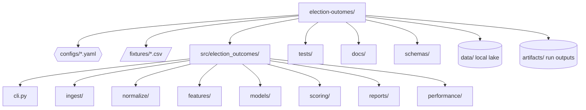
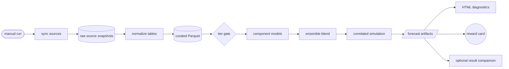
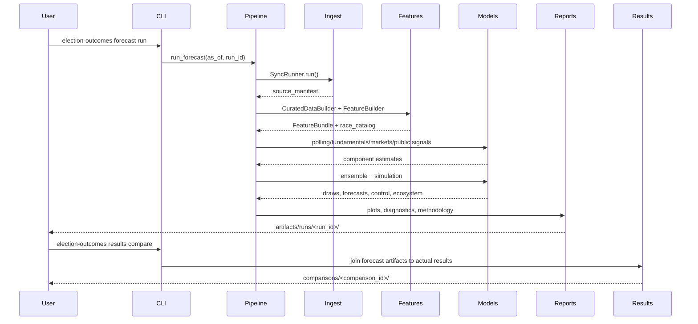
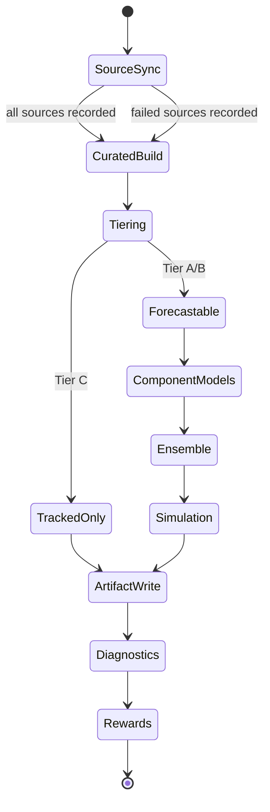
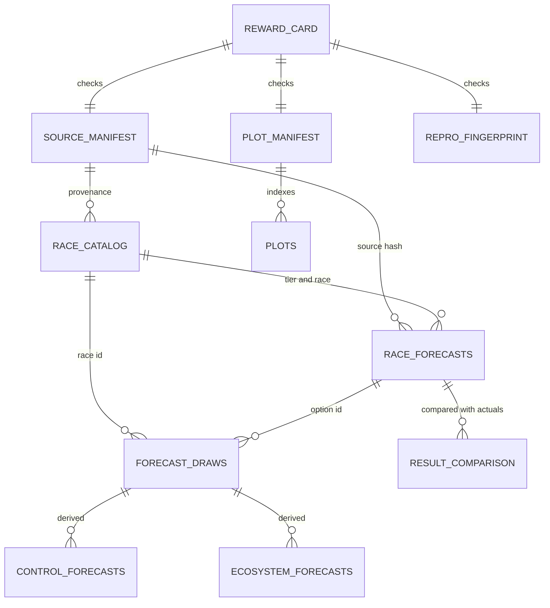
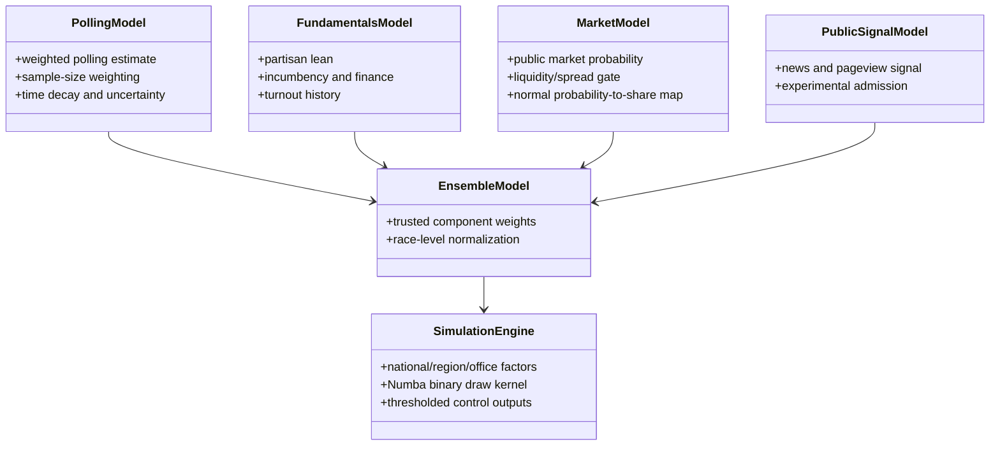
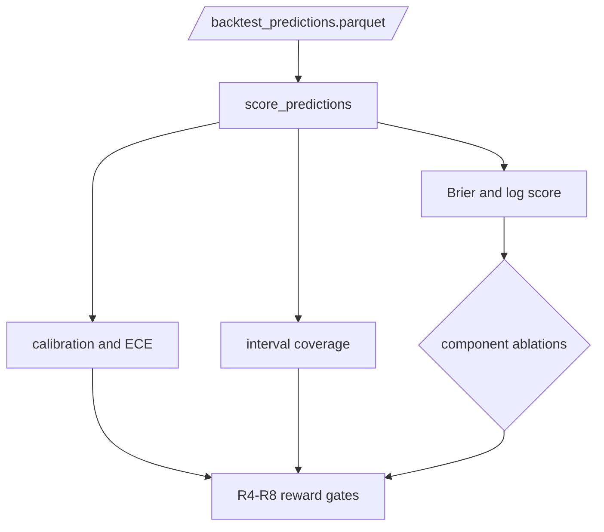
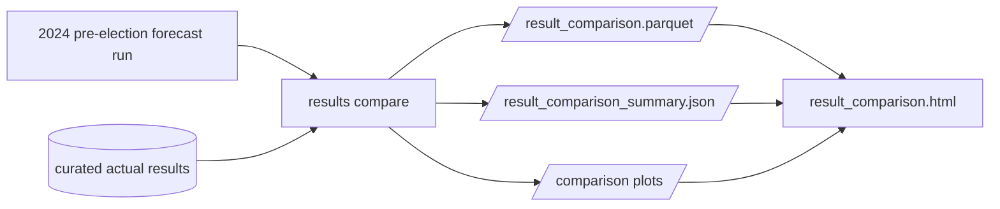
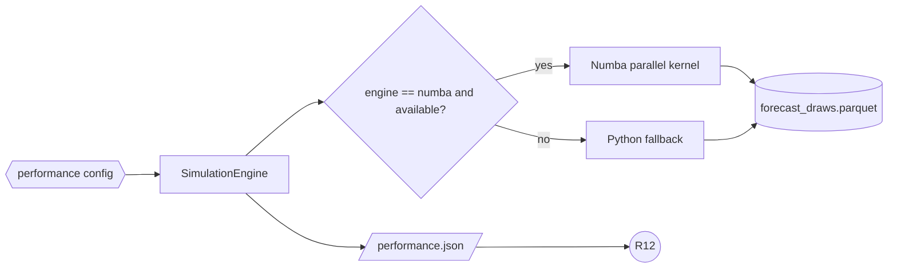
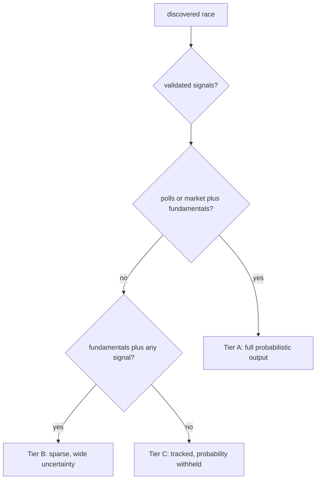

# Election Outcomes

Research-grade scaffold for a U.S.-only election forecasting engine. The package is
CLI-first: it incrementally syncs public data, builds a curated race catalog, runs a
hybrid forecast ensemble, emits auditable artifacts, generates calibration/projection
plots, and reports verifiable rewards.

The current implementation is fixture-backed so the full artifact, model, plotting,
performance, and reward contract can be tested deterministically before live public-data
adapters are added.

Canonical project documents:

- [`SPEC.md`](SPEC.md): durable implementation contract.
- [`AGENTS.md`](AGENTS.md): required agent operating rules.
- [`docs/technical_appendix.md`](docs/technical_appendix.md): detailed model and
  statistical approach.
- [`docs/performance.md`](docs/performance.md): Numba/benchmark performance contract.
- [`docs/api_requirements.md`](docs/api_requirements.md): live-ingestion API notes.

## Full Run

Use this when you want the richest current forecast output: refreshed source snapshots,
curated features, forecasts, posterior-style simulation draws, reward card, diagnostics,
plots, and performance metadata.

```bash
uv sync
chflags -R nohidden .venv
uv run election-outcomes forecast run --as-of 2026-05-08 --run-id full-forecast
```

The `chflags` command is included because this macOS environment has repeatedly hidden
`.venv` metadata after package syncs, which can prevent editable imports from loading.

Main output:

```text
artifacts/runs/full-forecast/
  race_catalog.parquet
  race_forecasts.parquet
  forecast_draws.parquet
  control_forecasts.parquet
  ecosystem_forecasts.parquet
  source_manifest.parquet
  diagnostics.html
  reward_card.json
  methodology_snapshot.md
  model_card.md
  silver_benchmark.json
  silver_benchmark.html
  reproducibility_fingerprint.json
  performance.json
  plot_manifest.json
  plots/
```

Open the run report:

```bash
open artifacts/runs/full-forecast/diagnostics.html
```

Inspect the reward card:

```bash
uv run python - <<'PY'
import json
from pathlib import Path

run = Path("artifacts/runs/full-forecast")
rewards = json.loads((run / "reward_card.json").read_text())["rewards"]
for name, payload in rewards.items():
    print(f"{name}: {payload['passed']} | {payload['detail']}")
PY
```

Current fixture-backed reward interpretation:

- `R1_reproducibility` writes a stable artifact fingerprint on every run, but only passes
  after rerunning the same `run_id` with unchanged inputs and matching the previous
  fingerprint.
- `R5_baseline_competition`, `R6_component_admission`, and `R8_uncertainty_quality` are
  intentionally not certified from the tiny fixture scorecard. They require a real
  rolling-origin backtest with enough historical races.
- `R2_provenance` is row-level: every forecast row must carry a model-config hash and
  source-manifest hash, and the manifest must contain non-empty source hashes.

Inspect the forecast tables:

```bash
uv run python - <<'PY'
from pathlib import Path
import polars as pl

run = Path("artifacts/runs/full-forecast")
print(pl.read_parquet(run / "race_catalog.parquet").select(["race_id", "tier", "tier_reason"]))
print(
    pl.read_parquet(run / "race_forecasts.parquet")
    .select(["race_id", "option_id", "tier", "winner_probability", "data_quality_flags"])
    .sort(["race_id", "option_id"])
)
PY
```

## Full Backtesting

Run the backtest scorecard and ablation report:

```bash
uv run election-outcomes backtest run --run-id full-backtest
```

Backtest output:

```text
artifacts/backtests/full-backtest/
  scorecard.json
  scorecard.parquet
  rolling_predictions.parquet
  component_admission.json
  residual_covariance.parquet
```

Inspect backtest metrics:

```bash
uv run python - <<'PY'
import json
from pathlib import Path

scorecard = json.loads(
    Path("artifacts/backtests/full-backtest/scorecard.json").read_text()
)
print(json.dumps(scorecard["metrics"], indent=2, sort_keys=True))
print(json.dumps(scorecard["ablations"], indent=2, sort_keys=True))
PY
```

The forecast run also embeds rolling-origin backtest diagnostics in `diagnostics.html`
and regenerates calibration plots from the current backtest predictions. For the richest
diagnostic bundle, run both commands:

```bash
uv run election-outcomes forecast run --as-of 2026-05-08 --run-id full-diagnostic
uv run election-outcomes backtest run --run-id full-diagnostic-backtest
open artifacts/runs/full-diagnostic/diagnostics.html
```

The current `backtest run` command refits components by held-out cycle and writes
component admission plus residual covariance artifacts. The bundled presidential-state
panel now has enough rows for the `president_state` benchmark to report evidence-based
`R5`, `R6`, and `R8` pass/fail values instead of sample-size placeholders.
Backtests now evaluate a date sweep when data exists: `T-90`, `T-60`, `T-30`, `T-7`,
and `T-1` days before the election. Sparse fixtures may only score later cuts because
feature rows are filtered by `as_of`.

## 2024 Presidential Historical Comparison

Use this workflow when you want to run a pre-election 2024 presidential forecast and
compare the forecast against known actual outcomes. The default offline registry includes
a 50-state-plus-DC presidential panel for 2000-2024 with Electoral College weights, public
returns-derived actuals, deterministic pre-election poll snapshots, and state fundamentals
features. This is still a compact benchmark fixture, not a claim to reproduce the final
Silver Bulletin or FiveThirtyEight model.

Run the scenario forecast using the pre-election default date of November 4, 2024:

```bash
uv sync
chflags -R nohidden .venv
uv run election-outcomes forecast run \
  --scenario president_2024_state \
  --run-id 2024-presidential
```

Run the same fixture-backed scenario as if the forecast were issued one month before
Election Day:

```bash
PYTHONPATH=src uv run election-outcomes forecast run \
  --scenario president_2024_state \
  --as-of 2024-10-05 \
  --run-id 2024-presidential-1mo \
  --data-dir data/run-2024-presidential-1mo \
  --artifacts-dir artifacts/run-2024-presidential-1mo
open artifacts/run-2024-presidential-1mo/runs/2024-presidential-1mo/diagnostics.html
```

Compare the forecast run with actual 2024 presidential results:

```bash
uv run election-outcomes results compare \
  --forecast-run-id 2024-presidential \
  --comparison-id 2024-presidential-actuals \
  --cycle 2024 \
  --office-type president
```

Interpretation for the 2024 benchmark: the run emits a full 538-EV simulation and
`results compare` reports state accuracy, Electoral College winner accuracy, Brier/log
style scoring fields, largest misses, and the probability assigned to each actual winner.
Treat misses as benchmark signals, not as reasons to tune directly against 2024 actuals.

Comparison output:

```text
artifacts/runs/2024-presidential/comparisons/2024-presidential-actuals/
  result_comparison.parquet
  race_outcomes.parquet
  largest_misses.parquet
  result_comparison_summary.json
  result_comparison.html
  narrative.md
  plots/
    vote_share_forecast_vs_actual.png
    winner_probability_vs_actual.png
    actual_winner_probabilities.png
    largest_vote_share_misses.png
```

Open the comparison report:

```bash
open artifacts/runs/2024-presidential/comparisons/2024-presidential-actuals/result_comparison.html
```

Run the presidential-state rolling-origin backtest directly:

```bash
uv run election-outcomes backtest run \
  --scenario president_state \
  --holdout-cycle 2024 \
  --run-id president-2024-backtest
```

Inspect the summary metrics:

```bash
uv run python - <<'PY'
import json
from pathlib import Path

summary = json.loads(
    Path(
        "artifacts/runs/2024-presidential/"
        "comparisons/2024-presidential-actuals/"
        "result_comparison_summary.json"
    ).read_text()
)
print(json.dumps(summary, indent=2, sort_keys=True))
PY
```

Inspect the row-level comparison:

```bash
uv run python - <<'PY'
from pathlib import Path
import polars as pl

comparison = pl.read_parquet(
    Path(
        "artifacts/runs/2024-presidential/"
        "comparisons/2024-presidential-actuals/"
        "result_comparison.parquet"
    )
)
print(
    comparison.select(
        [
            "race_id",
            "option_id",
            "winner_probability",
            "vote_share_mean",
            "actual_vote_share",
            "absolute_vote_share_error",
            "predicted_winner",
            "actual_winner",
        ]
    )
)
PY
```

The key interpretation fields are:

- `winner_accuracy`: whether the forecast's top option matched the actual winner.
- `state_accuracy`: presidential state-level winner accuracy over matched state races.
- `ec_winner_accuracy`: modeled Electoral College winner accuracy. The summary includes
  `electoral_college.scope`; for `president_2024_state` this should be
  `full_electoral_college`.
- `mean_absolute_vote_share_error`: average absolute forecast-share error.
- `brier_score`: probability score against actual winner indicators.
- `upset_count`: number of actual winners assigned less than 50% probability.
- `actual_winner_probabilities`: race-level probability assigned to each actual winner.
- `largest_misses`: the largest option-level vote-share misses by absolute error.

For multiple presidential cycles at the same forecast cut, prefer `results cycle-eval`.
It runs each `president_<cycle>_state` scenario, compares against actuals, and writes a
single dashboard with Electoral College probability, state accuracy, Brier score,
vote-share error, missed states, and links back to each run's diagnostics and comparison
report.

## First Live Poll Run

The first live-ingestion path uses FiveThirtyEight's public Datasette CSV stream for
the 2020 presidential poll archive. It does not need Google Civic. The live registry is
kept separate from the deterministic fixture registry so normal tests do not hit the
network.

Run a Wisconsin 2020 presidential forecast with live-downloaded 538 polls:

```bash
uv sync
chflags -R nohidden .venv
uv run election-outcomes forecast run \
  --sources-config sources_live.yaml \
  --data-dir data/live \
  --artifacts-dir artifacts/live \
  --as-of 2020-10-30 \
  --run-id wi-2020-live-polls
```

Rerun the same command once if you want `R1_reproducibility` to compare against the
previous stable fingerprint and pass.

Compare the forecast with actual Wisconsin 2020 results:

```bash
uv run election-outcomes results compare \
  --sources-config sources_live.yaml \
  --data-dir data/live \
  --artifacts-dir artifacts/live \
  --forecast-run-id wi-2020-live-polls \
  --comparison-id wi-2020-live-polls-actuals \
  --cycle 2020 \
  --office-type president \
  --race-id US-PRES-WI-2020
```

Outputs:

```text
artifacts/live/runs/wi-2020-live-polls/
artifacts/live/runs/wi-2020-live-polls/comparisons/wi-2020-live-polls-actuals/
```

Current live-source boundary:

- Live data: 538 public presidential poll CSV stream, normalized to `polls`.
- Fixture support data: race catalog, options, fundamentals, and actual result rows.
- Not live yet: full Civic race catalog, FEC finance, Census/FRED/BEA/BLS fundamentals,
  public market adapters, GDELT, Wikimedia, and broad historical backtest snapshots.

## Plots And Diagnostics

Every forecast run writes `plot_manifest.json` plus PNG plots under `plots/`.
`diagnostics.html` is the main readout: it combines the headline probability,
projected margin, scenario-scope warnings, driver attribution, trust gates, backtest
scorecards, the Silver/FiveThirtyEight methodology benchmark, and the plot gallery.
The visual style is intentionally closer to public 538-style explanatory dashboards,
but the benchmark remains methodological only; it does not claim to reproduce
proprietary Silver Bulletin or FiveThirtyEight forecasts.

Calibration plots:

- `calibration_curve.png`: observed win rate versus forecast probability.
- `brier_by_component.png`: Brier score by baseline/component/ensemble.
- `interval_coverage.png`: nominal versus observed interval coverage.

Projection plots:

- `race_probability_bars.png`: sorted winner probabilities with a 50% favored line.
- `vote_share_intervals.png`: vote-share means with 90% interval bands and win line.
- `control_projection.png`: modeled seat/control outcomes with threshold context.
- `turnout_recount_risk.png`: recount-risk projection by race with close-margin warning.
- `tier_coverage.png`: race coverage by Tier A/B/C with count labels.
- `electoral_college_distribution.png`: modeled presidential electoral-vote
  distribution, including a warning when only a state slice is modeled.
- `topline_electoral_swarm.png`: 538-inspired representative simulation swarm with
  modeled-scope labeling.

`diagnostics.html` now puts the Electoral College distribution and representative
simulation swarm together at the top of the report beside the summary boxes. The lower
projection grid keeps the race/control detail plots and avoids duplicating those two
top-line Electoral College views.

Trajectory and stability plots:

- `polling_kalman_trajectories.png`: Kalman latent vote-share paths with uncertainty
  bands and poll dots for the closest selected races.
- `polling_probability_trajectory.png`: rolling-origin polling-component probability
  by as-of cut when `polls_probability` and time-cut columns are available.
- `simulation_probability_convergence.png`: cumulative winner probability as simulation
  draws accumulate, generated when forecast draw rows are available.

Model quality plots:

- `electoral_college_chain_traces.png`: MCMC-style split-chain traces over posterior
  simulation draws for each party's Electoral College total. These are simulation
  chains, not a separate MCMC sampler.
- `kalman_posterior_uncertainty.png`: Kalman posterior standard deviation over time for
  the most uncertain selected race/options.

Benchmark plots:

- `silver_methodology_benchmark.png`: readiness scorecard against public
  Silver/FiveThirtyEight methodology traits.

The `silver_benchmark.json` and `silver_benchmark.html` artifacts compare the current
engine to public Nate Silver / FiveThirtyEight methodology dimensions: polling
inclusion, pollster weighting, fundamentals, rolling-origin validation, correlated
simulation, Electoral College reporting, polling trajectory/Kalman support, and driver
explainability. This is a methodology/readiness benchmark, not a claim to reproduce
proprietary forecasts. Scores use four honest tiers: `absent`, `scaffold`, `functional`,
and `production`, exposed as `tier_scale` in `silver_benchmark.json`, so an implemented
but undertrained path no longer receives full credit. Kalman or trajectory support is
credited only when it is visible in model config or run artifacts.

List plot outputs:

```bash
find artifacts/runs/full-forecast/plots -maxdepth 1 -type f | sort
```

View the plot manifest:

```bash
uv run python - <<'PY'
import json
from pathlib import Path

manifest = json.loads(
    Path("artifacts/runs/full-forecast/plot_manifest.json").read_text()
)
print(json.dumps(manifest, indent=2))
PY
```

Run a same-date historical benchmark sweep:

```bash
PYTHONPATH=src uv run election-outcomes results cycle-eval \
  --run-id oct5-presidential-cycle-eval \
  --cycles 2008,2012,2016,2020,2024 \
  --as-of-mm-dd 10-05 \
  --data-dir data/cycle-eval \
  --artifacts-dir artifacts/cycle-eval
```

Cycle-eval output:

```text
artifacts/cycle-eval/cycle_evals/oct5-presidential-cycle-eval/
  cycle_summary.parquet
  cycle_summary.json
  cycle_eval.html
  narrative.md
  plots/
```

## Performance Run

Binary two-option race simulation uses a Numba parallel kernel when available, with a
Python fallback. Run a benchmark after changing simulation, scoring, or forecast draw
logic:

```bash
uv run election-outcomes benchmark run --as-of 2026-05-08 --run-id full-perf
```

Benchmark output:

```text
artifacts/benchmarks/full-perf/performance_benchmark.json
```

Inspect performance metadata from a forecast:

```bash
uv run python - <<'PY'
import json
from pathlib import Path

print(
    json.dumps(
        json.loads(Path("artifacts/runs/full-forecast/performance.json").read_text()),
        indent=2,
        sort_keys=True,
    )
)
PY
```

## Required Validation

Every change must keep the repo passing:

```bash
uv sync
chflags -R nohidden .venv
uv run ruff check
uv run ruff format --check
uv run pytest --cov=src/election_outcomes --cov-fail-under=90
```

The coverage gate is part of the project contract. Do not lower it.

## Core Commands

- `sync`: snapshot configured fixture or HTTP CSV sources into the local raw lake.
- `build-features`: normalize raw snapshots into curated Parquet tables and race tiers.
- `forecast run`: refresh data, rebuild features, run models, simulate outcomes, emit
  artifacts, plots, rewards, diagnostics, and performance metadata.
- `backtest run`: refit components by rolling-origin cycle, score baselines and
  ablations, and emit admission/covariance artifacts.
- `report build`: rebuild diagnostics and methodology files for an existing run.
- `benchmark run`: measure simulation throughput using the configured performance engine.
- `results compare`: compare an existing forecast run against known actual results.

## Repository Map



## End-To-End Forecast Flow



## Control Flow



## Forecast State Machine



## Artifact Relationships



## Model Shape



## Backtest And Reward Flow



## Historical Comparison Flow



## Performance Flow



## Data Quality Tiers



## Trust Model

The engine distinguishes tracked races from forecastable races. Tier A/B races receive
probabilistic outputs. Tier C races remain in the catalog, but trusted probabilities are
withheld. The reward card checks provenance, reproducibility fingerprints, sync
integrity, calibration reporting, baseline competition, component admission,
sparse-race honesty, uncertainty quality, public-signal discipline, explainability,
plot generation, and performance metadata. Fixture-limited trust gates remain red rather
than pretending that four historical rows validate the model.

## API Credentials

No API credentials are needed to run the default fixture-backed engine, backtests,
plots, diagnostics, or benchmarks. The first live source in `configs/sources_live.yaml`
also runs keylessly because it consumes a public FiveThirtyEight/Datasette CSV stream.
For live-ingestion expansion, see [`docs/api_requirements.md`](docs/api_requirements.md).

Google Civic is optional. The current live path does not use `GOOGLE_CIVIC_API_KEY`, and
Civic should not block polling, fundamentals, market, or historical-result ingestion.

Current key names expected by the credential template:

```bash
awk -F= '/^[A-Za-z_][A-Za-z0-9_]*=/ {print $1}' .env.example
```

Remaining live-adapter implementation order:

1. Fundamentals: Census, FRED, BEA/BLS, and public election-result archives.
2. Race catalog: Google Civic and official state/federal race metadata.
3. Polls: public poll feeds and pollster metadata.
4. Markets: read-only Kalshi/Polymarket public data, with no trading credentials.
5. Public signals: GDELT and Wikimedia/pageview-style public attention features.

Until those adapters exist, a "full live run" means live polling plus deterministic
support tables, plots, rewards, performance metadata, and the fixture scorecard.
