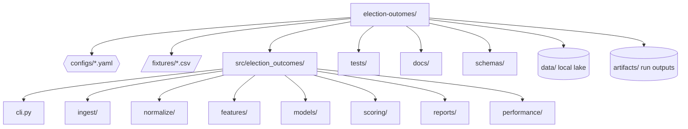
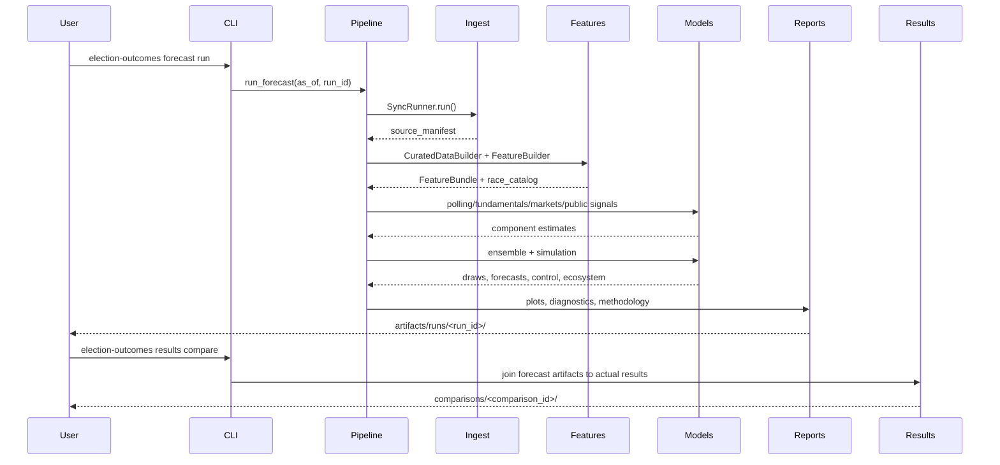
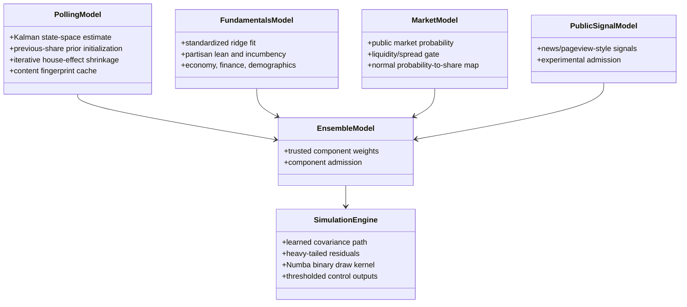
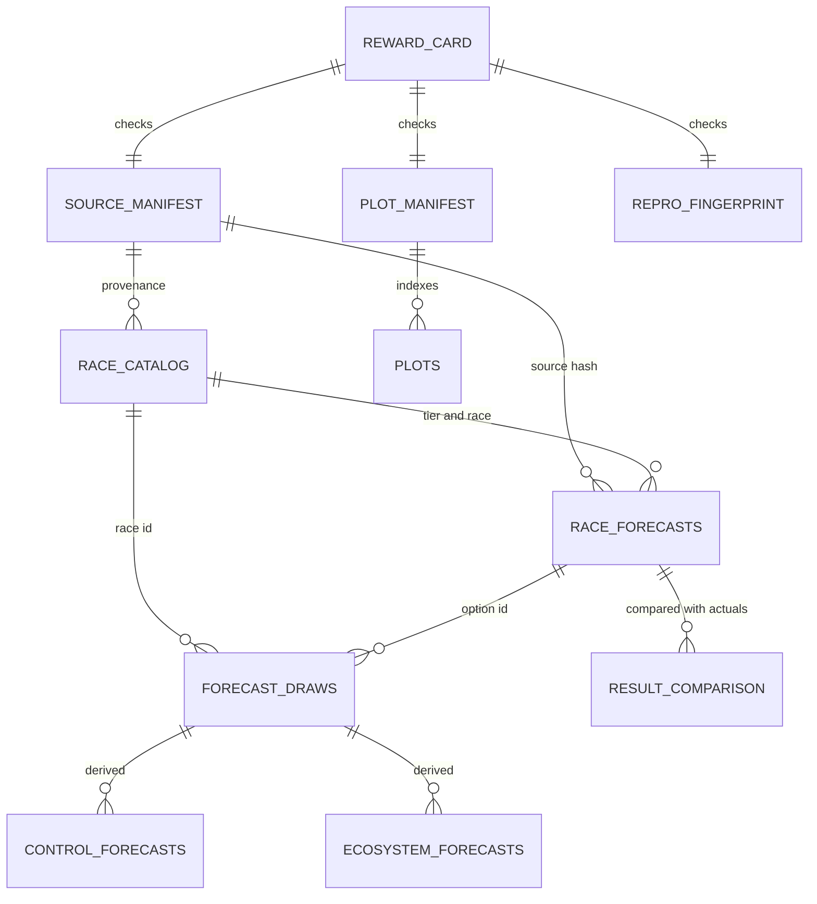

# Election Outcomes

CLI-first U.S. election forecasting engine. The package syncs public or fixture-backed
sources, builds curated race tables, runs polling/fundamentals/market/public-signal
components, simulates correlated outcomes, and writes auditable diagnostics.

The current default run is deterministic and fixture-backed so the full artifact,
plotting, reward, and benchmark contract can be tested before broader live adapters are
added. The presidential benchmark includes 50 states plus DC for 2000-2024 and supports
full Electoral College simulation.

Core project documents:

- [`SPEC.md`](SPEC.md): durable implementation contract.
- [`AGENTS.md`](AGENTS.md): required agent operating rules.
- [`docs/technical_appendix.md`](docs/technical_appendix.md): model details.
- [`docs/performance.md`](docs/performance.md): Numba and performance contract.
- [`docs/api_requirements.md`](docs/api_requirements.md): live-ingestion API notes.

## Package Initialization And Installation

Prerequisites:

- Python managed through `uv`.
- macOS/Linux shell.
- No API keys are required for default fixture-backed runs.

Install the package and local environment:

```bash
uv sync
chflags -R nohidden .venv
```

The `chflags` command is included because this macOS environment has repeatedly hidden
`.venv` metadata after package syncs, which can break editable imports.

Validate the repo:

```bash
uv run ruff check
uv run ruff format --check
PYTHONPATH=src uv run pytest --cov=src/election_outcomes --cov-fail-under=90
```

## Core Workflows

These are the commands to use most often.

### 1. Full Forecast

Run a complete forecast with diagnostics, plots, reward card, and reproducibility
fingerprint:

```bash
uv run election-outcomes forecast run \
  --as-of 2026-05-08 \
  --run-id full-forecast
```

Open the main report:

```bash
open artifacts/runs/full-forecast/diagnostics.html
```

Main output:

```text
artifacts/runs/full-forecast/
  race_catalog.parquet
  race_forecasts.parquet
  forecast_draws.parquet
  control_forecasts.parquet
  ecosystem_forecasts.parquet
  source_manifest.parquet
  diagnostics.html
  reward_card.json
  methodology_snapshot.md
  model_card.md
  silver_benchmark.json
  silver_benchmark.html
  reproducibility_fingerprint.json
  performance.json
  plot_manifest.json
  poll_trajectory.parquet
  stability_metrics.json
  plots/
```

### 2. Full Backtest

Run the rolling-origin scorecard, component admission, and residual covariance pass:

```bash
uv run election-outcomes backtest run \
  --scenario president_state \
  --run-id president-state-backtest
```

Backtest output:

```text
artifacts/backtests/president-state-backtest/
  scorecard.json
  scorecard.parquet
  rolling_predictions.parquet
  component_admission.json
  residual_covariance.parquet
```

The presidential-state benchmark evaluates multiple pre-election cuts where data exists:
`T-90`, `T-60`, `T-30`, `T-7`, and `T-1`.

### 3. Full Cycle Analysis

Run the same-date historical presidential benchmark across cycles:

```bash
PYTHONPATH=src uv run election-outcomes results cycle-eval \
  --run-id oct5-presidential-cycle-eval \
  --cycles 2008,2012,2016,2020,2024 \
  --as-of-mm-dd 10-05 \
  --data-dir data/cycle-eval \
  --artifacts-dir artifacts/cycle-eval
```

Open the cycle dashboard:

```bash
open artifacts/cycle-eval/cycle_evals/oct5-presidential-cycle-eval/cycle_eval.html
```

Cycle-eval output:

```text
artifacts/cycle-eval/cycle_evals/oct5-presidential-cycle-eval/
  cycle_summary.parquet
  cycle_summary.json
  cycle_eval.html
  narrative.md
  plots/
```

The cycle dashboard reports simulated/control Electoral College winner accuracy, state
accuracy, Brier score, vote-share error, upsets, missed states, and links to each
cycle's diagnostics and comparison report. It also retains the deterministic
state-topline EC winner from `results compare` as an audit field.

## 2024 Presidential Benchmark

Run the 2024 presidential scenario at the default pre-election date:

```bash
uv run election-outcomes forecast run \
  --scenario president_2024_state \
  --run-id 2024-presidential
```

Compare against actual 2024 presidential results:

```bash
uv run election-outcomes results compare \
  --forecast-run-id 2024-presidential \
  --comparison-id 2024-presidential-actuals \
  --cycle 2024 \
  --office-type president
```

Open the comparison report:

```bash
open artifacts/runs/2024-presidential/comparisons/2024-presidential-actuals/result_comparison.html
```

Use this benchmark to inspect misses and calibration. Do not tune directly against 2024
actuals; use cross-cycle evidence and rolling-origin backtests.

## Senate And House Analysis

The engine ships parallel scenarios for U.S. Senate (state-level) and U.S. House
(district-level) races with their own panels, parsers, and source registries. Reports
lead with the **majority story**: each chamber has its own configured threshold (Senate
51, House 218) and the control forecast surfaces holdover seats, modeled seats,
seat-count distribution, and majority probability per party.

### Senate Cycle Analysis

Run rolling-origin same-date evaluation across Senate Class I/II/III rotations from
2014–2024:

```bash
uv run election-outcomes results cycle-eval \
  --cycles 2014,2016,2018,2020,2022,2024 \
  --as-of-mm-dd 11-04 \
  --scenario-template "senate_{cycle}_state" \
  --forecast-run-prefix sen-eval \
  --office-type senate \
  --sources-config sources_senate.yaml \
  --data-dir data/senate \
  --artifacts-dir artifacts/senate \
  --run-id senate-cycles-2014-2024
```

Open the dashboard:

```bash
open artifacts/senate/cycle_evals/senate-cycles-2014-2024/cycle_eval.html
```

Each per-cycle forecast lives at
`artifacts/senate/runs/sen-eval-<cycle>-1104/` with the full diagnostics, model card,
silver benchmark, control forecast, and forecast-vs-actual comparison.

### House Cycle Analysis

Same-date evaluation across the 6 most recent House cycles:

```bash
uv run election-outcomes results cycle-eval \
  --cycles 2014,2016,2018,2020,2022,2024 \
  --as-of-mm-dd 11-04 \
  --scenario-template "house_{cycle}_district" \
  --forecast-run-prefix hou-eval \
  --office-type house \
  --sources-config sources_house.yaml \
  --data-dir data/house \
  --artifacts-dir artifacts/house \
  --run-id house-cycles-2014-2024
```

Open the dashboard:

```bash
open artifacts/house/cycle_evals/house-cycles-2014-2024/cycle_eval.html
```

The House panel covers all 435 districts × 6 cycles spanning two redistricting eras
(`2012_2020` and `2022_plus`). Polls are restricted to competitive districts; safe
seats are forecast through fundamentals only.

### Defining Majority In Reports

`control_forecasts.parquet` for each Senate/House run carries:

- `control_threshold` — 51 for Senate, 218 for House (from `configs/model.yaml`).
- `holdover_seats` — Senate seats not up that cycle, sourced from the scenario.
- `modeled_seats` — number of seats actually being contested.
- `seat_count_modeled_mean` — mean seats won in modeled races (across draws).
- `seat_count_mean`, `seat_count_p10/p50/p90` — total post-cycle seats including
  holdovers, with 80% interval.
- `majority_probability` — `P(seat_count >= control_threshold)`.
- `seats_to_majority_mean` — seats short of majority on average.
- `tipping_point_races`, `pivotal_rates` — most pivotal contests for control.

`cycle_eval.html` and `narrative.md` lead with chamber name + threshold, then per-cycle
DEM/REP majority probabilities, mean seat counts, race accuracy, and missed
states/districts.

### Source Registries For Each Chamber

```text
configs/sources.yaml         # Presidential state-panel + fixture defaults.
configs/sources_senate.yaml  # Senate state-panel (Class rotation), 6 cycles.
configs/sources_house.yaml   # House district-panel, 6 cycles, 2 redistricting eras.
configs/sources_live.yaml    # Live 538 polling overlay (extends sources.yaml).
```

Each registry supports `extends:` to layer real-data adapters on top of the panel
fixture without duplicating non-conflicting entries.

### Scenarios

```text
president_state, president_2000_state ... president_2024_state
senate_state,    senate_2014_state    ... senate_2024_state, senate_2026_state
house_district,  house_2014_district  ... house_2024_district, house_2026_district
```

Senate scenarios declare `senate_class` (I/II/III) and `holdovers` (DEM/REP/IND seat
counts not up that cycle). House scenarios declare `redistricting_era` so rolling
origin training stays within a comparable boundary regime.

### Synthetic Panel Honesty

The 2014–2024 Senate and House panels are deterministic procedural draws that match
aggregate historical patterns (D/R seat swings, Cook PVI distribution, incumbency
advantage). They are not actual historical results. The harness exists to exercise
the rolling-origin and majority-threshold contracts at scale; production runs should
ingest real returns from MIT Election Lab + 538 senate/house polls. Regenerate panels
with:

```bash
uv run python scripts/generate_senate_panel.py
uv run python scripts/generate_house_panel.py
```

## What To Inspect

Important forecast artifacts:

- `diagnostics.html`: top-line summary, EC distribution and swarm, model drivers, trust
  gates, backtest snapshot, Silver/FiveThirtyEight methodology benchmark, and plots.
- `race_forecasts.parquet`: per-option probabilities, vote-share intervals, drivers,
  data-quality flags, and lineage hashes.
- `forecast_draws.parquet`: race-level posterior-style simulation draws.
- `control_forecasts.parquet`: EC/control probability, EV/seat distributions, and
  pivotal/tipping information.
- `reward_card.json`: machine-readable reward checks.
- `model_card.md`: learned/configured/placeholder parameter status.

Current trust boundary:

- Default data is deterministic fixture/panel data.
- The default presidential panel is useful for development and benchmark shape, but it
  is not a reproduction of Silver Bulletin or FiveThirtyEight.
- Live polling can be enabled with `configs/sources_live.yaml`; most live adapters are
  still planned.

## Repository Map



## End-To-End Flow


## Control Flow



## Model Shape



## Artifact Relationships



## Appendix A: Expanded Commands

### Inspect Reward Card

```bash
uv run python - <<'PY'
import json
from pathlib import Path

run = Path("artifacts/runs/full-forecast")
rewards = json.loads((run / "reward_card.json").read_text())["rewards"]
for name, payload in rewards.items():
    print(f"{name}: {payload['passed']} | {payload['detail']}")
PY
```

### Inspect Forecast Tables

```bash
uv run python - <<'PY'
from pathlib import Path
import polars as pl

run = Path("artifacts/runs/full-forecast")
print(pl.read_parquet(run / "race_catalog.parquet").select(["race_id", "tier", "tier_reason"]))
print(
    pl.read_parquet(run / "race_forecasts.parquet")
    .select(["race_id", "option_id", "tier", "winner_probability", "data_quality_flags"])
    .sort(["race_id", "option_id"])
)
PY
```

### Inspect Backtest Metrics

```bash
uv run python - <<'PY'
import json
from pathlib import Path

scorecard = json.loads(
    Path("artifacts/backtests/president-state-backtest/scorecard.json").read_text()
)
print(json.dumps(scorecard["metrics"], indent=2, sort_keys=True))
print(json.dumps(scorecard["ablations"], indent=2, sort_keys=True))
PY
```

### One-Month-Before 2024 Scenario

```bash
PYTHONPATH=src uv run election-outcomes forecast run \
  --scenario president_2024_state \
  --as-of 2024-10-05 \
  --run-id 2024-presidential-1mo \
  --data-dir data/run-2024-presidential-1mo \
  --artifacts-dir artifacts/run-2024-presidential-1mo
open artifacts/run-2024-presidential-1mo/runs/2024-presidential-1mo/diagnostics.html
```

### Inspect 2024 Result Comparison

```bash
uv run python - <<'PY'
import json
from pathlib import Path

summary = json.loads(
    Path(
        "artifacts/runs/2024-presidential/"
        "comparisons/2024-presidential-actuals/"
        "result_comparison_summary.json"
    ).read_text()
)
print(json.dumps(summary, indent=2, sort_keys=True))
PY
```

```bash
uv run python - <<'PY'
from pathlib import Path
import polars as pl

comparison = pl.read_parquet(
    Path(
        "artifacts/runs/2024-presidential/"
        "comparisons/2024-presidential-actuals/"
        "result_comparison.parquet"
    )
)
print(
    comparison.select(
        [
            "race_id",
            "option_id",
            "winner_probability",
            "vote_share_mean",
            "actual_vote_share",
            "absolute_vote_share_error",
            "predicted_winner",
            "actual_winner",
        ]
    )
)
PY
```

### Reuse Existing Cycle-Eval Artifacts

```bash
PYTHONPATH=src uv run election-outcomes results cycle-eval \
  --run-id oct5-presidential-cycle-eval \
  --cycles 2008,2012,2016,2020,2024 \
  --as-of-mm-dd 10-05 \
  --data-dir data/cycle-eval \
  --artifacts-dir artifacts/cycle-eval \
  --reuse-existing
```

### Live 538 Poll Smoke Run

The first live-ingestion path uses FiveThirtyEight's public Datasette CSV stream for
the 2020 presidential poll archive. It does not need Google Civic.

```bash
uv run election-outcomes forecast run \
  --sources-config sources_live.yaml \
  --data-dir data/live \
  --artifacts-dir artifacts/live \
  --as-of 2020-10-30 \
  --run-id wi-2020-live-polls
```

```bash
uv run election-outcomes results compare \
  --sources-config sources_live.yaml \
  --data-dir data/live \
  --artifacts-dir artifacts/live \
  --forecast-run-id wi-2020-live-polls \
  --comparison-id wi-2020-live-polls-actuals \
  --cycle 2020 \
  --office-type president \
  --race-id US-PRES-WI-2020
```

### Performance Benchmark

```bash
uv run election-outcomes benchmark run \
  --as-of 2026-05-08 \
  --run-id full-perf
```

Benchmark output:

```text
artifacts/benchmarks/full-perf/performance_benchmark.json
```

## Appendix B: Diagnostics And Plots

Every forecast writes `plot_manifest.json` and PNG plots under `plots/`.

Projection plots:

- `race_probability_bars.png`
- `vote_share_intervals.png`
- `control_projection.png`
- `turnout_recount_risk.png`
- `tier_coverage.png`
- `electoral_college_distribution.png`
- `topline_electoral_swarm.png`

Calibration and model-quality plots:

- `calibration_curve.png`
- `brier_by_component.png`
- `interval_coverage.png`
- `polling_kalman_trajectories.png`
- `polling_probability_trajectory.png`
- `simulation_probability_convergence.png`
- `electoral_college_chain_traces.png`
- `kalman_posterior_uncertainty.png`
- `silver_methodology_benchmark.png`

List plot outputs:

```bash
find artifacts/runs/full-forecast/plots -maxdepth 1 -type f | sort
```

View the plot manifest:

```bash
uv run python - <<'PY'
import json
from pathlib import Path

manifest = json.loads(
    Path("artifacts/runs/full-forecast/plot_manifest.json").read_text()
)
print(json.dumps(manifest, indent=2))
PY
```

## Appendix C: CLI Reference

- `sync`: snapshot configured fixture or HTTP CSV sources into the local raw lake.
- `build-features`: normalize raw snapshots into curated Parquet tables and race tiers.
- `forecast run`: refresh data, rebuild features, run models, simulate outcomes, and
  emit artifacts.
- `backtest run`: refit components by rolling-origin cycle and score baselines.
- `report build`: rebuild diagnostics and methodology files for an existing run.
- `benchmark run`: measure simulation throughput.
- `results compare`: compare one forecast run against known actual results.
- `results cycle-eval`: run same-date historical forecast-vs-actual analysis.

## Appendix D: Trust, Rewards, And API Credentials

Reward interpretation:

- `R1_reproducibility` writes a stable artifact fingerprint on every run, but only passes
  after rerunning the same `run_id` with unchanged inputs and matching the previous
  fingerprint.
- `R5_baseline_competition`, `R6_component_admission`, and `R8_uncertainty_quality`
  require enough historical rows and should stay honest when sample sizes are weak.
- `R2_provenance` is row-level: every forecast row must carry a model-config hash and
  source-manifest hash.

No API credentials are needed to run default fixture-backed forecasts, backtests, plots,
diagnostics, comparisons, or benchmarks. The first live source in
`configs/sources_live.yaml` also runs keylessly through a public FiveThirtyEight CSV.

Google Civic is optional. The current live path does not use `GOOGLE_CIVIC_API_KEY`, and
Civic should not block polling, fundamentals, market, or historical-result ingestion.

Current key names expected by the credential template:

```bash
awk -F= '/^[A-Za-z_][A-Za-z0-9_]*=/ {print $1}' .env.example
```

Remaining live-adapter implementation order:

1. Historical results: MIT Election Lab or official state/federal archives.
2. Fundamentals: Census, FRED, BEA/BLS.
3. Polls: public poll feeds and pollster metadata.
4. Markets: read-only Kalshi/Polymarket public data, with no trading credentials.
5. Public signals: GDELT and Wikimedia/pageview-style public attention features.
